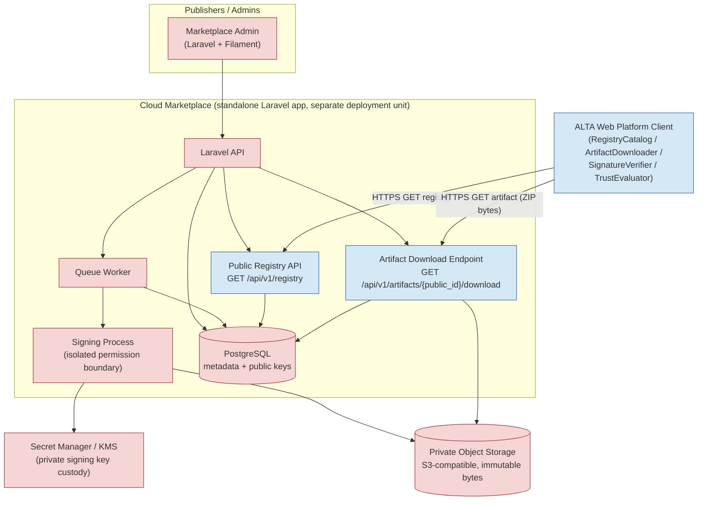

# Cloud Marketplace — Architecture

> Phase C1. Documentation only. No implementation.

## 1. Architecture decision (fixed for C1)

1. Cloud Marketplace is a **standalone Laravel application**.
2. It is a **separate deployment unit** from ALTA Web Platform.
3. The **production target is a separate repository**. Creating that repository
   is **out of scope for C1** — this specification lives in the ALTA repository
   only as the contract between the ALTA client and the future backend.
4. Metadata database: **PostgreSQL**.
5. Artifact storage: **private S3-compatible object storage** (concrete provider
   deliberately not chosen in C1 — see `decisions.md`).
6. Admin: **Laravel + Filament**.
7. Public registry: **read-only** `GET /api/v1/registry`.
8. Artifact delivery: a **stable HTTPS download proxy** on the Marketplace domain
   (`GET /api/v1/artifacts/{artifact_public_id}/download`) that reads bytes from
   private object storage and returns them as a ZIP. The private object-storage
   URL is **never** exposed to the client.
9. Signing: **Ed25519** over **raw ZIP bytes** (`raw-zip-v1`). The private key is
   held only by the signing process via a secret manager / KMS-compatible
   solution.
10. Automatic discover/register/install/enable is **not** part of Cloud
    Marketplace. Backup & Restore is **not** part of Marketplace core.

## 2. Core principle

> **Object storage is never the public source of truth for the ALTA client.**
> The source of truth is the **Cloud Marketplace API**. The client only ever
> talks to the Marketplace API host (registry + download proxy); it never
> receives, resolves, or trusts a raw object-storage URL.

## 3. Components

| Component | Responsibility | Trust / exposure |
|---|---|---|
| **Marketplace Admin (Filament)** | Publisher & release management, review, approve, revoke, deprecate, unpublish. | Private, authenticated. |
| **Laravel API** | Application core; hosts Public Registry API and Artifact Download Endpoint; enforces projection & validation. | Public read-only surfaces + private admin surfaces. |
| **PostgreSQL** | Metadata: publishers, keys (public only), addons, versions, artifacts, signatures, reviews, state transitions, audit. | Private. Never holds private key bytes. |
| **Queue Worker** | Async validation, checksum/inspection, registry (re)generation, cache invalidation, audit fan-out. | Private. |
| **Signing Process** | Ed25519 signing over final raw ZIP bytes; isolated permission boundary. | Private; only component with access to the private signing key material. |
| **Secret Manager / KMS** | Custody of the private signing key (or a reference/identifier to it). | Private; not in Git, not in DB as plaintext, not in logs. |
| **Private Object Storage (S3-compatible)** | Immutable artifact bytes. | Private; **no public URLs**, no presigned URLs in the registry. |
| **Public Registry API** | `GET /api/v1/registry`; current-public-release projection. | Public read-only. |
| **Artifact Download Endpoint** | `GET /api/v1/artifacts/{public_id}/download`; streams exact immutable bytes. | Public read-only; Marketplace host. |
| **ALTA Web Platform Client** | Consumes registry, downloads to quarantine, verifies SHA-256 + Ed25519, inspects manifest, trust/review/stage/promote/rollback. | External consumer; trust boundary. |

## 4. Component diagram (Mermaid)

## 5. Data flows

### A. Publisher / admin upload
Publisher authenticates to Admin and uploads a candidate ZIP for an addon
`code`/`version`. The upload is stored as a **draft/uploaded** artifact candidate
in private object storage under an immutable object key; a `release` row is
created in `draft`/`uploaded`. No public exposure yet.

### B. Validation
A queue job computes SHA-256 over the exact bytes, performs read-only manifest
**identity** inspection (see §7 of `security-and-signing.md` — this is identity
inspection, **not** full schema validation), checks size, type, and
publication-validation rules. Result → `validation_failed` or `ready_for_review`.

### C. Signing
On approval-eligible artifacts, the **Signing Process** signs the **exact final
raw ZIP bytes** with the publisher's **active** Ed25519 key using the private key
from the Secret Manager. The signature (base64) and `key_id` are persisted; the
private key never leaves the signing boundary. After signing, the ZIP must not be
repacked, recompressed, or modified in any way (see signing rules).

### D. Approval and publication
A reviewer approves; an admin publishes. Publication moves the release to
`published` and marks it eligible for the current-public-release projection.
Published artifact bytes become immutable.

### E. Registry generation
A queue job regenerates the registry projection (or it is computed on read with
caching). The projection selects **at most one current public release per addon
code** and emits the backward-compatible JSON. `ETag`/`Last-Modified` are updated.

### F. Client download and verification
The client fetches `GET /api/v1/registry`, merges with its local catalog, and for
a remote artifact issues `GET /api/v1/artifacts/{public_id}/download`. The client
verifies SHA-256 over the received bytes and the Ed25519 signature over those
same bytes using a locally-configured trusted public key, then inspects the
manifest and evaluates trust — all client-side, unchanged from today.

### G. Revoke / deprecate / unpublish
Admin transitions a release. `revoked` and `unpublished` releases are **excluded**
from the public v1 projection. `revoked` artifact downloads return `410 Gone`.
`deprecated` may remain downloadable per policy. All transitions are append-only
with actor, timestamp, reason, and an audit event. Artifact **bytes are not
physically deleted** during ordinary unpublish/revoke.

## 6. Queue, audit, health boundaries

- **Queue boundary:** long-running work (validation, signing orchestration,
  registry regeneration, cache invalidation, audit fan-out) runs on the Queue
  Worker, never inline in the public request path.
- **Audit boundary:** every state transition and every administrative action
  writes an append-only `audit_events` row; audit is not mutated or deleted.
- **Health / readiness:** liveness and readiness endpoints exist for operations
  (see `deployment-and-operations.md`) and never expose secrets, keys, or
  storage URLs.
- **Logs / metrics boundary:** structured logs and metrics exclude private keys,
  signature secrets, credentials, and object-storage/presigned URLs.

## 7. ALTA client trust boundary

The client trusts:
- the Marketplace **API host** (allowlisted), and
- Ed25519 public keys present in its **own** `config('addons-registry.trust.trusted_keys')`.

The client does **not** trust the backend to change its trusted keys; key
onboarding/rotation is out-of-band client config deployment (see
`security-and-signing.md`).
