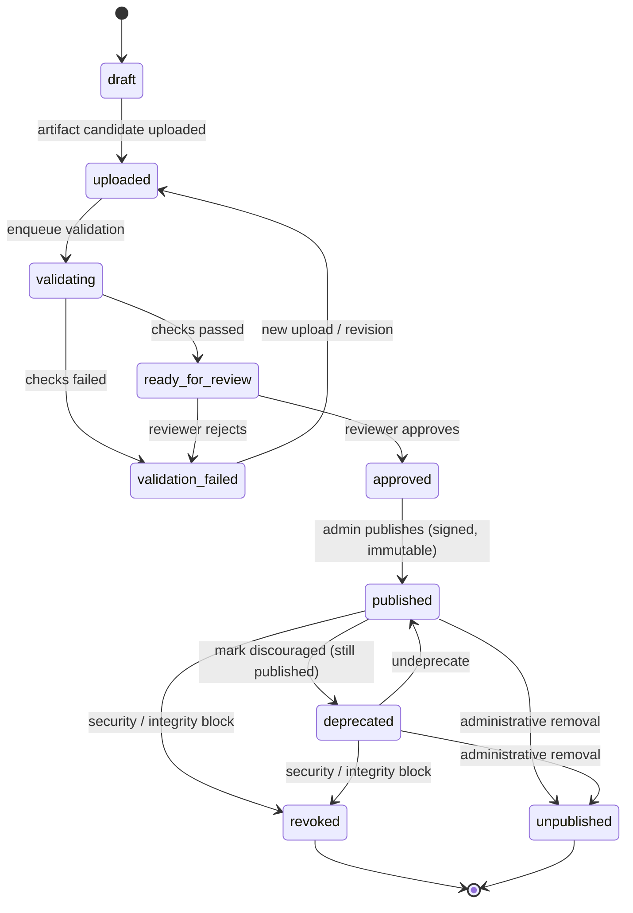

# Cloud Marketplace — Release Lifecycle

> Phase C1. Specification only.

## 1. States

```
draft
  → uploaded
  → validating
  → validation_failed  |  ready_for_review
  → approved
  → published
  → deprecated
  → revoked  |  unpublished
```

## 2. State diagram (Mermaid)



## 3. Transition rules

- `validation_failed` can return to `uploaded` via a **new upload / revision**.
- A **published** artifact is **immutable**; its bytes never change.
- Fixing an artifact creates a **new addon version** or a **new pre-publication
  revision** — never an in-place edit of published bytes.
- After publication, **bytes are not changed**.
- `deprecated` means **available but discouraged** (still published).
- `revoked` means a **security / integrity block**.
- `unpublished` means **administrative removal** from the public registry.
- `revoked` / `unpublished` releases are **not** returned to the current client
  via Registry API v1 (excluded from the projection).
- A **revoked** artifact download endpoint returns **`410 Gone`**.
- A **deprecated** artifact **may remain downloadable** per policy.
- Rolling back a publication state **does not rewrite history** — it is a new
  forward transition recorded append-only.
- **Every** transition has an **actor**, **timestamp**, **reason**, and an
  **audit event** (`release_state_transitions` + `audit_events`).
- Artifact **bytes are not physically deleted** on `revoked` / `unpublished`
  (business deletion ≠ physical byte deletion; see `data-model.md`).

## 4. Current-public-release projection (Registry API v1)

The registry projection selects, per addon `code`, **at most one** item — the
**current public release** — using these rules:

1. **Eligibility filter** — a release is eligible only if **all** hold:
   - `state = published` (or `deprecated`-but-still-published — see rule 3);
   - has a valid **immutable artifact** with `size > 0` and lowercase-hex SHA-256;
   - has an **Ed25519 signature** (`raw-zip-v1`);
   - the **signing key is not revoked**;
   - it passed **publication validation**.
   Releases in `draft|uploaded|validating|validation_failed|ready_for_review|
   approved` and all `revoked|unpublished` releases are **excluded**.

2. **Selection** — among eligible releases for an addon, prefer the **highest
   published version** that is **compatible** and **not deprecated**.

3. **Deprecated handling:**
   - A `deprecated` release is eligible only while still published.
   - It is **not** selected as current if a newer **non-deprecated compatible
     published** release exists.
   - If **no** non-deprecated eligible release exists, whether the deprecated
     release is emitted as current is a **product-owner policy decision**
     (recorded **OPEN BEFORE C4** in `decisions.md`). This spec does not silently
     choose the final business policy.
   - When emitted, the additive field `deprecated: true` is set; the current
     client ignores it.

4. **Output** — exactly one item per addon (or zero if no eligible release),
   with the client-supported fields plus permitted additive fields. No
   `available_versions`, no draft/pre-publication/revoked/unpublished releases.

The `is_current_public` boolean on `addon_versions` (partial unique per addon)
is the persisted realisation of this projection; the API reads it (or recomputes
it) to build the response.
